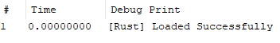

# Windows Kernel Driver Written In Rust

so i wanted to learn rust, this repo is the result of that.

## what is this?

this is a windows kernel driver written in rust. right now it doesnt do much, just loads prints a debug message. 



## why rust?

i wanted to learn rust and the memory safety features seemed like theyd be nice to have when writing code that can blue screen your entire system. also the rust kernel driver ecosystem (`windows-drivers-rs`) looked interesting.

## code structure

```
├── Cargo.toml          # package config, driver type set to KMDF
├── build.rs            # wdk build configuration
├── build.bat           # lazy build script
└── src/
    └── lib.rs          # driver entry point, KdPrint macro
```

## key parts

**`driver_entry()`** - the entry point called when the driver loads. currently just prints a debug message and returns `STATUS_SUCCESS`

**`KdPrint!` macro** - convenience wrapper around `DbgPrint` for debug output. only works in debug builds.

**`WDKAllocator`** - global allocator for kernel mode. required since we can't use the standard allocator.

## building

just run the batch file:

```cmd
build.bat
```

it compiles in release mode and copies the result to `build/driver.sys`.

or manually:
```cmd
cargo build --release
copy target\release\driver.dll build\driver.sys
```

## testing

enable test signing:
```cmd
bcdedit /set testsigning on
```

reboot, then load the driver:
```cmd
sc create RustDriver type= kernel binPath= C:\path\to\build\driver.sys
sc start RustDriver
```

use [DebugView](https://learn.microsoft.com/en-us/sysinternals/downloads/debugview) to see the debug output. you should see `[Rust] Loaded Successfully` if it worked.

unload with:
```cmd
sc stop RustDriver
sc delete RustDriver
```

## what i learned

- everything is `unsafe` because we're in the kernel
- can't use standard library, panic must abort
- debug strings need a null terminator (`\0`)

## resources

- [windows-drivers-rs](https://github.com/microsoft/windows-drivers-rs) - the framework making this possible
- [WDK docs](https://learn.microsoft.com/en-us/windows-hardware/drivers/) - windows driver documentation
- [Rust Book](https://doc.rust-lang.org/book/) - learning rust itself

## disclaimer

this is a learning project. i'm new to rust. use at your own risk, in a VM.